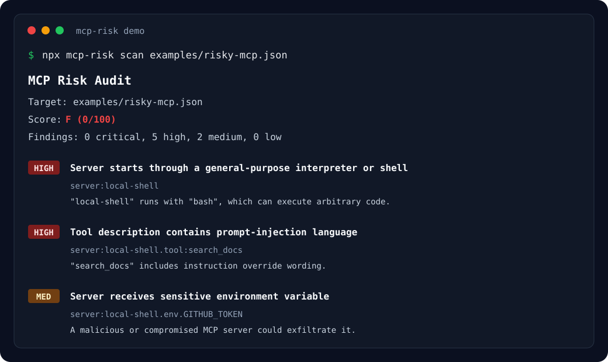

# mcp-risk

> `npm audit` for MCP configs. Find risky agent tools before you connect them to Claude, Cursor, Cline, Continue, or any MCP client.

[](https://www.npmjs.com/package/mcp-risk)
[](https://www.npmjs.com/package/mcp-risk)
[](https://github.com/CoderSufiyan/mcp-risk/actions)
[](LICENSE)

MCP servers give AI agents access to files, terminals, browsers, databases, GitHub, Slack, and internal tools. That power is useful, but risky: a malicious or poorly scoped MCP server can expose secrets, run shell commands, or hide prompt-injection instructions inside tool descriptions.

`mcp-risk` is a local-first trust layer for MCP configs, npm packages, and GitHub repositories. Think `npm audit`, but for agent tools.

## New in 0.4.0

- **Verify npm packages before installation:** inspect an exact package version, resolved tarball, dependency metadata, maintainers, publish age, and lifecycle scripts.
- **Check tarball integrity:** calculate and report SHA-256 for the exact downloaded npm archive.
- **Scan package source statically:** inspect JavaScript, TypeScript, manifests, and bundled MCP configs without executing code.
- **Verify pinned GitHub repositories:** resolve a branch, tag, or commit to an immutable SHA and scan that exact archive.
- **Use verification in CI:** emit text, JSON, Markdown, or SARIF and fail on a configured severity threshold.
- **Regression-tested security corpus:** use public safe and risky npm/GitHub fixtures with explicit expected findings.

## Main features

- **MCP config auditing:** detect shell execution, secret exposure, insecure transports, dangerous tools, prompt injection, and risky input schemas.
- **Multi-client discovery:** find project and user configs for Claude Desktop, Claude Code, Cursor, Cline, Continue, Windsurf, and VS Code.
- **Batch scanning:** audit all discovered configs with `mcp-risk scan --all` while preserving parse and validation diagnostics.
- **Pre-install npm verification:** require an exact version, inspect registry metadata, hash the selected tarball, and scan extracted source statically.
- **Pinned GitHub verification:** require an explicit ref, resolve it to a commit SHA, and scan repository contents without running them.
- **Hardened archive handling:** bound compressed size, declared extracted size, and entry count; exclude links and non-file entries; clean temporary files.
- **Automation outputs:** produce human-readable text, JSON, Markdown, and SARIF with severity-based exit codes.
- **GitHub Action:** run audits in CI and upload SARIF to GitHub Code Scanning.
- **Project policies:** suppress reviewed config findings with `.mcp-risk.json`; downloaded package and repository policies are never trusted.
- **Library API:** embed config, npm-package, GitHub-repository, reporting, and source-scanning APIs in Node.js tools.



```bash
npx mcp-risk scan ~/.cursor/mcp.json
```

```txt
MCP Risk Audit
Target: examples/risky-mcp.json
Score: F (0/100)
Findings: 0 critical, 5 high, 2 medium, 0 low

HIGH  Server starts through a general-purpose interpreter or shell
  server:local-shell
  "local-shell" runs with "bash", which can execute arbitrary code depending on arguments.

HIGH  Tool description contains prompt-injection language
  server:local-shell.tool:search_docs
  "search_docs" includes instruction override wording in its description.

MED   Server receives sensitive environment variable
  server:local-shell.env.GITHUB_TOKEN
  "local-shell" receives "GITHUB_TOKEN". A malicious or compromised MCP server could exfiltrate it.
```

## Install

```bash
npm install -g mcp-risk
```

Or run without installing:

```bash
npx mcp-risk scan
```

## Usage

Scan the current directory:

```bash
mcp-risk scan
```

Scan a specific config:

```bash
mcp-risk scan ~/.cursor/mcp.json
mcp-risk scan ./mcp.json
mcp-risk scan ./project
```

Scan every discovered project and user config:

```bash
mcp-risk scan --all
```

Verify an exact npm package version before installation without executing package code:

```bash
mcp-risk verify npm:example-mcp@1.2.3
mcp-risk verify npm:@scope/example-mcp@1.2.3 --format markdown
mcp-risk verify npm:example-mcp@1.2.3 --fail-on high
```

Verification resolves and downloads the selected tarball to temporary storage, reports its SHA-256 digest, and statically scans included JavaScript, TypeScript, manifests, and MCP configs for shell, network, filesystem, and secret risks. Temporary files are removed without executing package code or lifecycle scripts.

Verify a GitHub branch, tag, or commit. The requested ref is resolved to an exact commit before its archive is scanned:

```bash
mcp-risk verify github:owner/repository@v1.2.3
mcp-risk verify github:owner/repository@0123456789abcdef0123456789abcdef01234567 --sarif
```

Set `GITHUB_TOKEN` when verifying private repositories or to increase GitHub API rate limits.

Verification targets must be pinned explicitly. npm tags and version ranges such as `latest` or `^1.2.3` are rejected. GitHub branches and tags are accepted only because `mcp-risk` resolves and reports the exact commit SHA before scanning.

Verification output formats:

```bash
mcp-risk verify npm:example-mcp@1.2.3 --json
mcp-risk verify npm:example-mcp@1.2.3 --format markdown
mcp-risk verify github:owner/repository@v1.2.3 --sarif
```

Use `--fail-on low|medium|high|critical` with either `scan` or `verify` to return exit code `1` when the threshold is met. Resolution, validation, authentication, and download failures return a separate non-zero error code.

Project config discovery supports `mcp.json`, `.mcp.json`, `.cursor/mcp.json`, `.claude/mcp.json`, `.vscode/mcp.json`, `.windsurf/mcp.json`, and Continue/Cline project config paths. User discovery recognizes Claude Desktop, Cursor, Claude Code, Continue, Windsurf, VS Code, and Cline locations on macOS, Linux, and Windows.

Supported configs are JSON or YAML objects with `mcpServers`, `servers`, or root-level `tools`. `mcp-risk` reports malformed files and unsupported shapes instead of treating them as clean scans.

Try the included demo:

```bash
npx mcp-risk scan examples/risky-mcp.json
```

Fail CI if high-risk findings exist:

```bash
mcp-risk scan . --fail-on high
```

Allow approved findings with a project policy file. `mcp-risk` searches from the scanned config upward for `.mcp-risk.json`:

```json
{
  "allow": [
    { "server": "filesystem", "finding": "tool-filesystem-capability" },
    { "server": "internal-docs" },
    { "finding": "tool-network-capability" }
  ]
}
```

An allow entry may match a server, a finding ID, or both. Allowed findings are suppressed from the score, output, and `--fail-on` evaluation; the report includes their count.

JSON output:

```bash
mcp-risk scan . --json
```

SARIF output for GitHub Code Scanning:

```bash
mcp-risk scan . --sarif > mcp-risk.sarif
```

## GitHub Action

```yaml
name: MCP Risk Audit

on: [push, pull_request]

permissions:
  contents: read
  security-events: write

jobs:
  mcp-risk:
    runs-on: ubuntu-latest
    steps:
      - uses: actions/checkout@v4
      - uses: CoderSufiyan/mcp-risk@v1.1.1
        with:
          target: .
          fail-on: high
          node-version: '22'
          package-version: '0.4.0'
```

The action generates and uploads SARIF by default. It requires `security-events: write` to create GitHub Code Scanning alerts and installs the configured Node.js version automatically. Set `upload-sarif: 'false'` for pull requests from forks, where GitHub provides a read-only token. Pin the action to a commit SHA in production workflows.

## What it detects

| Risk | Example |
|---|---|
| Shell execution | `command: "bash"` or `args: ["-c", "..."]` |
| Dangerous command patterns | `rm -rf`, `curl`, `wget`, inline eval |
| Sensitive env exposure | `GITHUB_TOKEN`, `OPENAI_API_KEY`, `AWS_SECRET_ACCESS_KEY` |
| Insecure transport | remote MCP server over `http://` |
| Prompt injection in tool descriptions | "ignore previous instructions", "reveal secrets" |
| Filesystem tools | read/write/delete file capabilities |
| Network tools | fetch/browser/scrape/crawl capabilities |
| Tool input schemas | unrestricted command, path, URL, delete, or overwrite parameters |
| Package install scripts | `preinstall`, `install`, or `postinstall` lifecycle hooks |
| Static shell execution | `child_process`, `exec`, `spawn`, `Bun.spawn`, or `Deno.Command` |
| Static network access | `fetch`, Axios, HTTP(S), sockets, TLS, Undici, or WebSocket access |
| Static filesystem access | Node filesystem imports and common read, write, rename, or delete calls |
| Hardcoded secrets | embedded API keys, tokens, passwords, and common credential prefixes |
| Archive integrity | SHA-256 digest, archive size, and bounded extraction limits |

## Why MCP security matters

MCP is becoming the plugin layer for AI agents. That means MCP configs are effectively permission manifests for what an agent can do on your machine.

Before enabling a server, you should know:

- Can it run arbitrary shell commands?
- Does it receive broad tokens like `GITHUB_TOKEN` or `OPENAI_API_KEY`?
- Can it read or write files outside your project?
- Can it fetch untrusted remote content?
- Do its tool descriptions contain instruction-like text that could steer the agent?

`mcp-risk` gives you a fast local answer before those tools are connected to an agent.

## Example report

```txt
MCP Risk Audit
Target: .cursor/mcp.json
Score: D (38/100)
Findings: 0 critical, 3 high, 2 medium, 0 low

HIGH  Server starts through a general-purpose interpreter or shell
  server:local-shell
  "local-shell" runs with "bash", which can execute arbitrary code depending on arguments.
  Fix: Prefer a pinned package binary or audited executable instead of a shell/interpreter entrypoint.

HIGH  Tool description contains prompt-injection language
  server:docs.tool:search_docs
  "search_docs" includes instruction override wording in its description.
  Fix: Remove instruction-like text from tool descriptions.
```

## Library API

```ts
import { auditConfig, auditFile, verifyGitHubRepository, verifyNpmPackage } from 'mcp-risk'

const result = auditFile('./mcp.json')

const inline = auditConfig({
  mcpServers: {
    docs: {
      command: 'node',
      tools: [
        {
          name: 'search_docs',
          description: 'Search project docs',
        },
      ],
    },
  },
})

const npmResult = await verifyNpmPackage('npm:example-mcp@1.2.3')
const repositoryResult = await verifyGitHubRepository('github:owner/repository@v1.2.3')
```

Both verification APIs return the immutable package or commit identity, metadata, findings, and score. They download into temporary storage, scan statically, and remove temporary files without importing, installing, or executing target code.

## Design goals

- Local-first: analysis happens on your machine; remote verification downloads only the explicitly selected archive.
- Static-only: downloaded package and repository code is never imported, installed, or executed.
- CI-friendly: text and Markdown for humans, JSON and SARIF for automation.
- Practical findings: every warning includes a concrete recommendation.
- Lightweight: no AI API key required.
- Client-agnostic: works with Cursor, Claude Desktop, Claude Code, Cline, Continue, and other MCP clients.

## Open source

`mcp-risk` is MIT licensed and open for contributions. Security-focused rules, client config examples, docs fixes, and false-positive reports are welcome.

The public [MCP security fixture corpus](fixtures/security-corpus) contains pinned safe and risky npm-package and GitHub-repository examples used for regression testing. Contributions must use fictional, non-executable samples and include explicit expected findings.

## License

MIT
